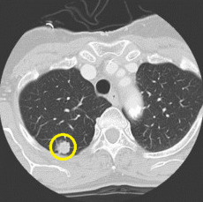
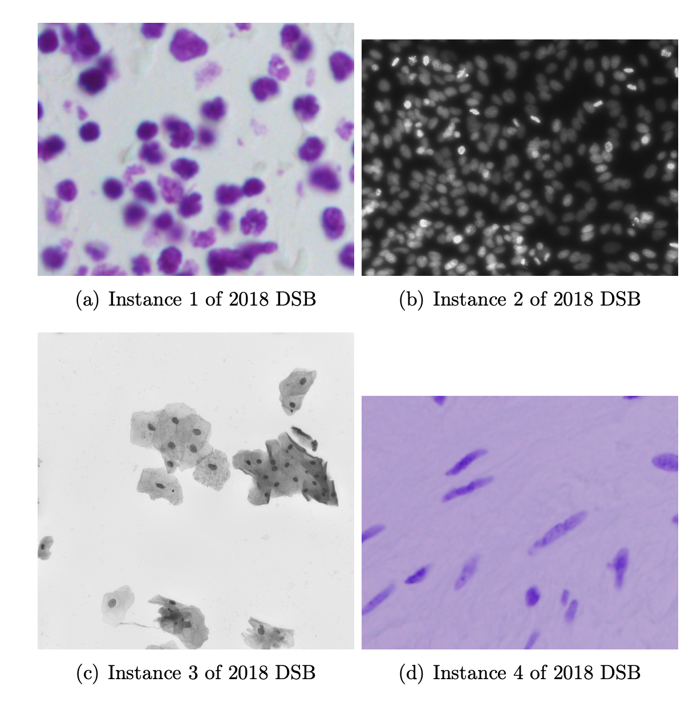
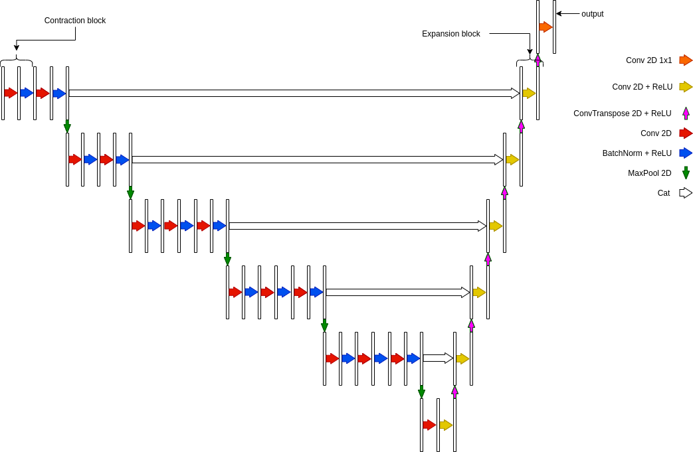
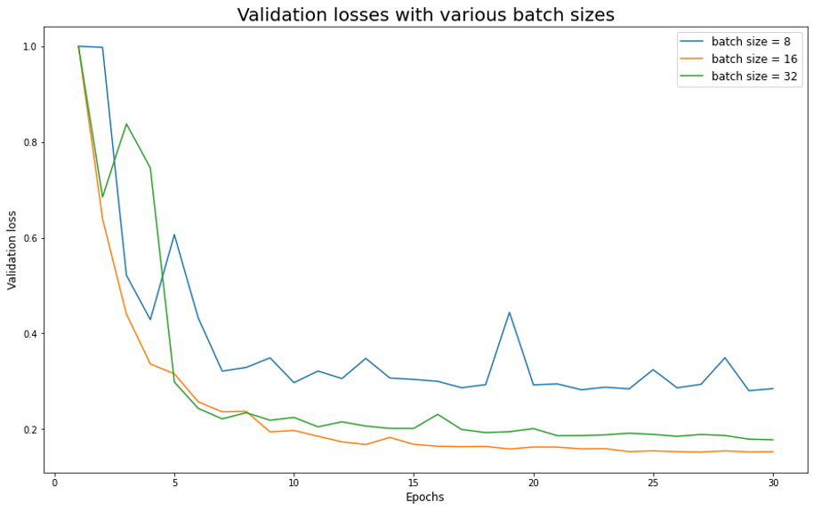
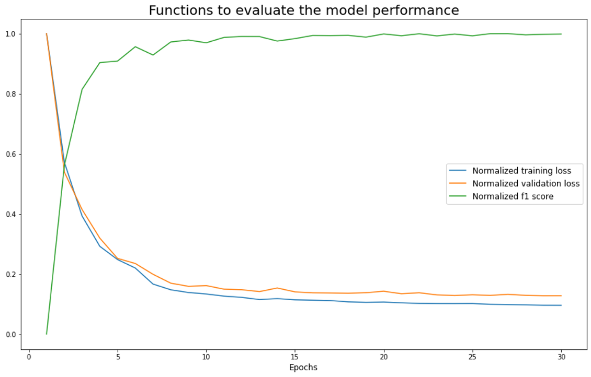
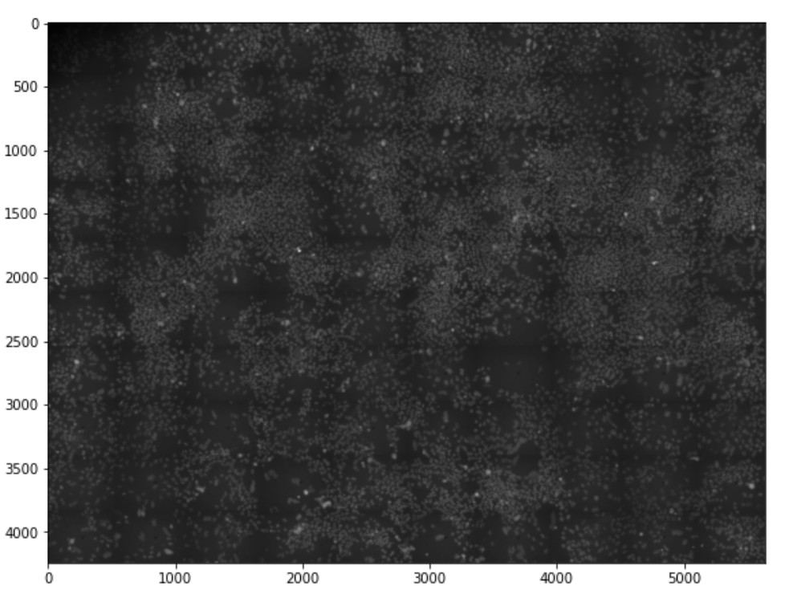
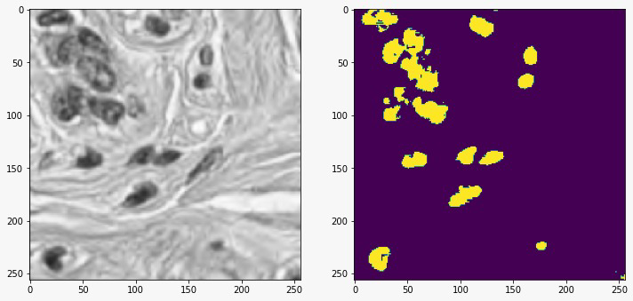
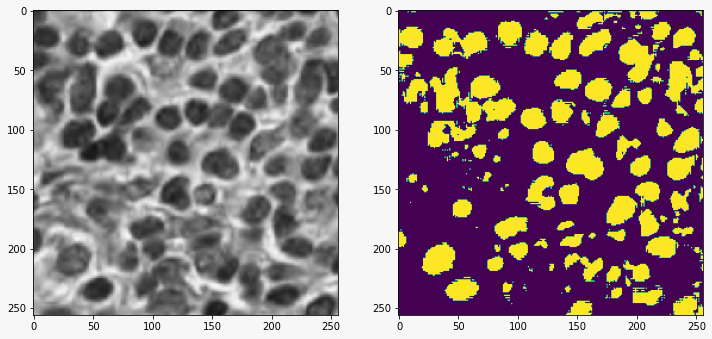
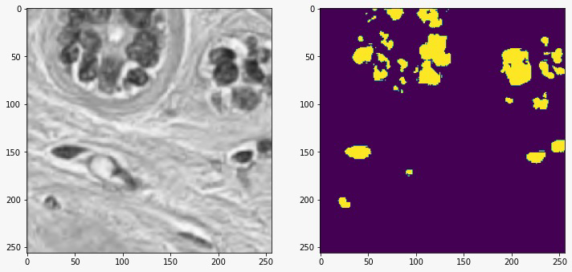

# U-Net: Segmentation of Biomedical Images!

**Implementation and contributions to the U-Net network, a deep convolutional encoder-decoder trained to perform semantic-segmentation on biomedical images, in order to both distinguish whether there is a disease and localize the abnormal area.

## Segmentation Problem

‘Our ability to measure and alter biology far surpasses our ability to actually understand it’, writes Ed Regis in his renowned book What is life?, citing Brendan Frey, co-founder of the Canadian company Deep Genomics. We indeed know very little about the complexity of biological processes, compared to the accuracy we have achieved in observing and even engineering them. Imaging, synthesis and sequencing techniques can be used in perspective to build complex genetic circuits that replicate pre-programmed metabolic processes and to advance the diagnosis and treatment of many diseases poorly known today. 

Humans possess a great variety of sensory systems that diagnosticians can exploit to identify whether a certain medical disease is present in a patient or not. Automating this process in a robust and accountable way is still a very open challenge today. When a human observer views a scene, his or her visual system segments the scene semantically, and this feature can be used widely for diagnostic purposes. Automated visual analysis of biomedical images can prove itself as an extremely powerful tool to speed up the diagnostic process.

  

By marking the desired type of cells with a known dye, the cells nuclei can be spotted and photographed.

## Work Environment

In order to train our network, we downloaded the nuclei images provided on the Kaggle website, as dataset for the 2018 Data Science Bowl: Find the nuclei in divergent images to advance medical discovery **kaggle**. The dataset contained 670 segmented nuclei images. Since the images were acquired under a variety of conditions, namely different tissues and cell type, magnification, and imaging modality (brightfield vs. fluorescence). The dataset diversity was designed purposely to challenge an algorithm’s ability to generalize across these variations. Below, we give an example of the diversity of the images present in the dataset.

  

The first preprocessing step we had to perform on the dataset was standardization . The shapes of the images, being taken in different environment, were very variable. We had to uniform their shape to the optimal for our network, that we identified as 256x256.

Data augmentation is essential to teach the network the desired invariance and robustness properties, when only few training samples are available. In case of microscopical images especially random elastic deformations of the training samples seem to be the key to train a segmentation network with very few annotated images.

[kaggle]: https://github.com/andresz1/size-limit-action

## Architecture of the network

The architecture we inspired to is shown below. U-net is one of the most powerful archi- tectures to perform biomedical images segmentation. We use it as a blueprint to build our own architecture exploiting the u-shape and the concatenation between encoder and decoder features.
In particular, we chose for the contraction path a network used to perform images classi- fication: the VGG-16\_bn network. We decided to use it due to the possibility to download pre-trained weights and to switch on and off the batch-norm layers. We performed two modifications to adapt VGG to our needs. We removed the fully connected layers and the softmax layer. Moreover, we slightly changed the width and height of the images.

  

The network has therefore a total of 27 convolutional layers. We thought of adding some dropout layers, but since our model is not prone to overfitting, we discarded this idea. Our model has a couple of implementation options that can be set before training. First, the user can ‘switch on’ the batch normalization , that as we know makes every training example interact with the other examples of the minibatch. Despite beneficial properties of batch-norm, including the enhanced stability of gradient descent and speed of training, we observed a worsening in the performance of the network, due to decreased contrast particularly at the border of the pictures.

## Training: loss and variables

In our network, the loss function is computed by a pixel-wise binary cross entropy with logit:

Before identifying the BCE as the optimal loss function, we experimented training with Dice Loss.

## Optimal hyperparameters tuning

After building the architecture of the network, the next step was optimizing the learning hyperparameters, namely the so called linesearch algorithm . We imposed two different schedulers to the learning rate , WarmRestart and Cyclic, in order to find the optimal parameters for the gradient descent algorithm. We split the dataset in training and validation sets, and performed training for 30 epochs, using various networks with different schedulers, and varying the maximum learning rate of the scheduler. We used a high momentum (0.9) such that a large number of the previously seen training samples determine the update in the current optimization step. We show below the loss function during validation and training, and the f1 score as a function of the epochs, for the optimal network.

As we see from the graphics, the optimal network, namely those that reach the minimum of the loss within the least epochs, has a mini batch size of 16. We observed a better performance with scheduler WarmRestart, with maximum learning rate 0,4. 

## Performance of the network: Results

Once we identified the optimal neural network, we used it to segment different datasets from the one we used to train the network. We present in this section two examples of the performance of the network on these datasets.

# Differentiating neural stem cells

As a first application of our network, we segmented an image provided by the laboratory of IIT@Sapienza Center for Life Nano Science. The picture was taken with an epifluorescent microscope, and showed a population of fluorescing Neural Stem Cells differentiating and evolving in vitro. The dimensions of the image were 4704x6240.

We could finally obtain the segmentation of the image on the right of figure 5, by merging (in order) all the unpadded masks, obtained by slicing the masks obtained just like the one on the right of figure 8. The result of this segmentation problem is shown below.

# Histological images of cancerous tissues

As a second application, we downloaded the dataset of a different Kaggle challenge. This dataset contained histological images of various cancerous tissues, from kidneys, to livers, to lungs and more. We show below the segmented images obtained through the network on this dataset.

We could not quantify the reliability of the segmentation through the f1 score, due to the absence of a reliable ground truth of the images. Let us stress that the images used in this application are way different form the ones used during the training session; despite the little accuracy we therefore considered the solution to the segmentation problem acceptable at glance, meaning that the network has abstracted the problem’s global features.

## Conclusions

Let us retrace the steps made during the realization of this project.
The aim was to develop a deep neural network able to produce reliable segmentation masks of biomedical images. 
One of the crucial points of our project resides in the data augmentation made in the dataset class. We have implemented five random transformations that leave the learning process untouched but yield to an infinite number of data and as a consequence the near impossibility of achieving overfitting.
The satisfactory 0.93 F1 score reached after ca. 40 epochs of training with the optimal model comes from the solid structure of the net; the pretrained batchnormed vgg16\_bn encoder decomposes and underlines the features necessary to accomplish the segmentation task; while the concatenated decoder grasps the little details lost in the first portion of the model.
The collaboration between PyTorch an Optuna allowed us to handle hyperparameter tuning; the results have shown best performances using BCE with logistic loss, coupled with the stochastic gradient descent, as optimizer. We set 0.9 momentum and a warm restart scheduler for the learning rate.
As a personal observation, we would like to note the network’s ability to underline the segmented blobs’ edges, a task that not always the human being manages to accomplish. Maybe this could also explain the reason why we cannot reach a higher F1-score during our experiments, in fact, we noticed that sometimes the target masks were less accurate than the output of our model.

